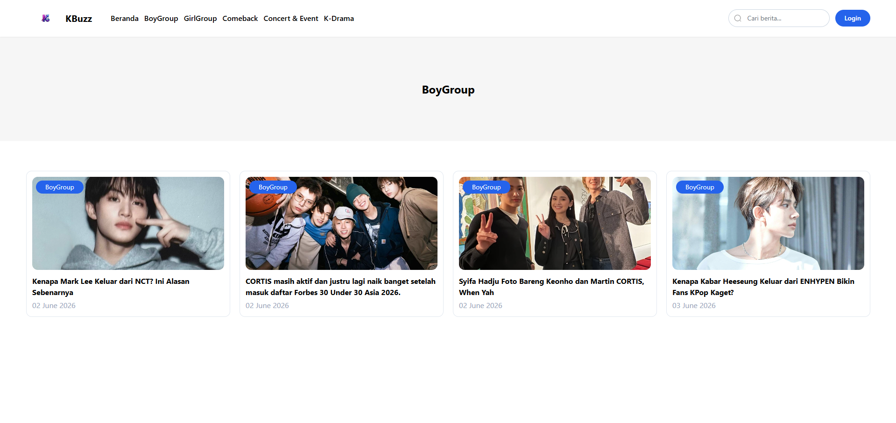
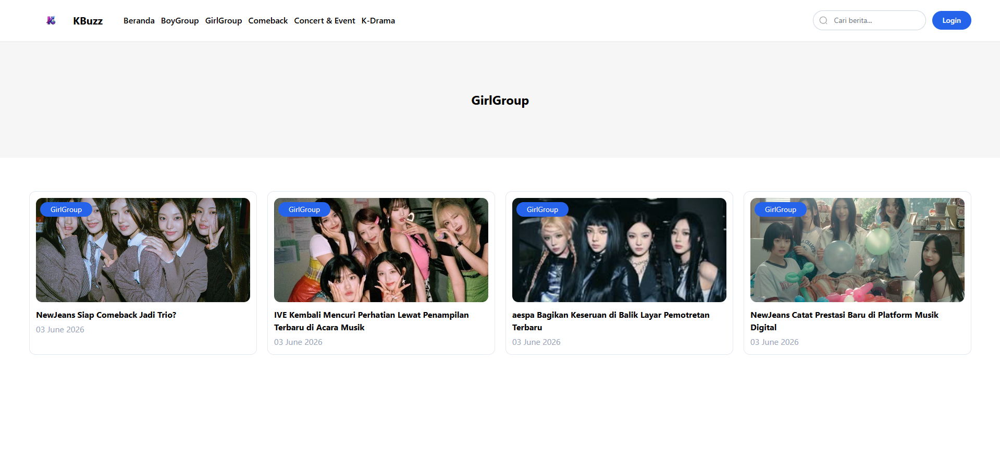
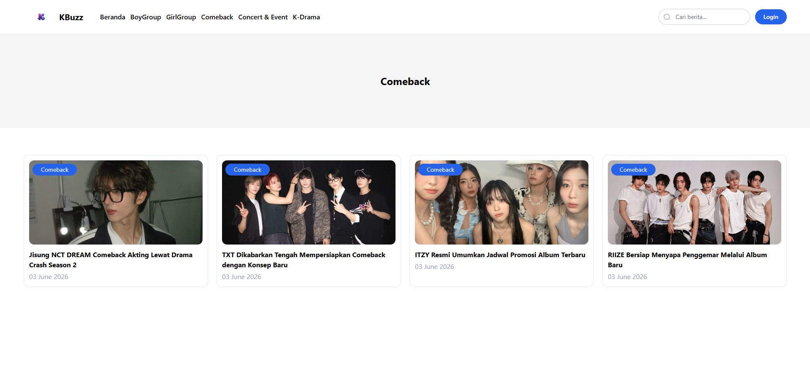
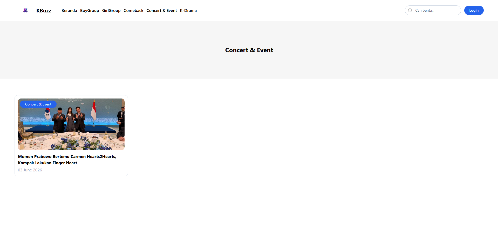
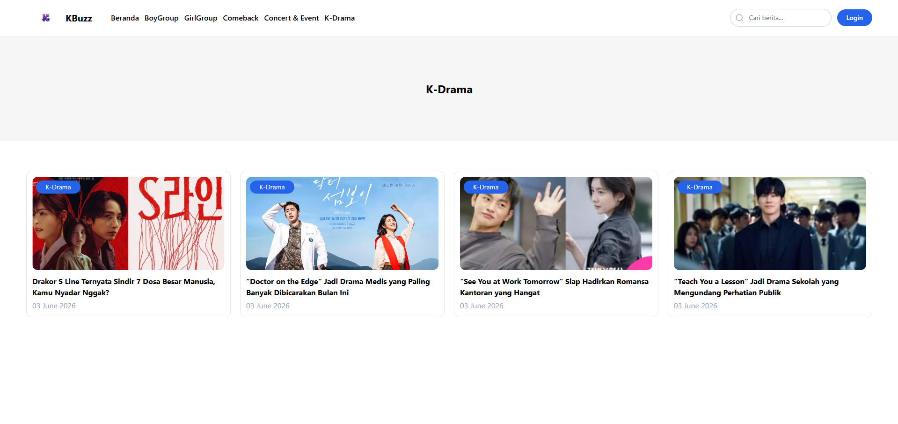
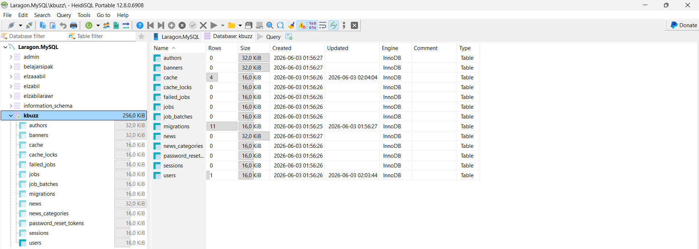
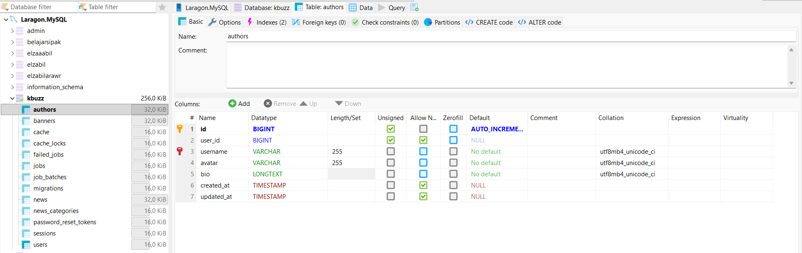
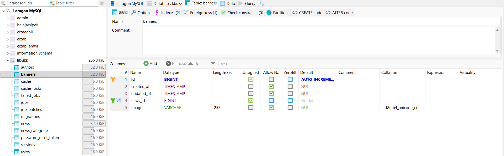
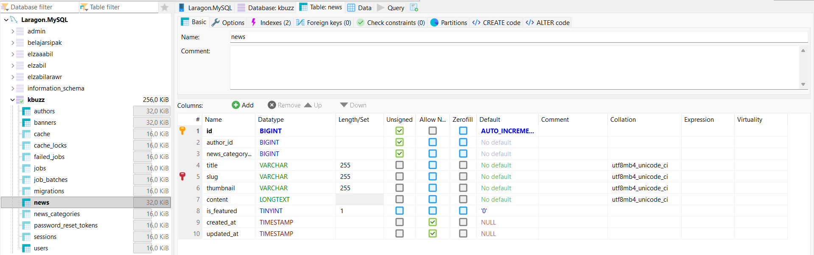

# KBuzz — Portal Berita Online

KBuzz adalah website portal berita online berbasis Laravel 12 dengan fitur manajemen konten menggunakan Filament Admin Panel.

---

## Tech Stack

- **Backend:** Laravel 12
- **Admin Panel:** Filament
- **Frontend:** Blade + Tailwind CSS
- **Build Tool:** Vite
- **Database:** MySQL (via XAMPP)
- **Slider:** Swiper.js

---

## Fitur

- Berita dengan kategori (BoyGroup, GrilGroup, Comeback, Concert & Event, K-drama)
- Manajemen Author
- Banner / Hero Slider
- Pagination kustom
- Pencarian berita
- Halaman admin dengan role-based access (hanya admin yang bisa akses)

---

## Instalasi

### 1. Clone repository

```bash
git clone https://github.com/username/kbuzz.git
cd kbuzz
```

### 2. Install dependencies

```bash
composer install
npm install
```

### 3. Konfigurasi environment

```bash
cp .env.example .env
php artisan key:generate
```

Edit file `.env`, sesuaikan konfigurasi database:

```env
DB_CONNECTION=mysql
DB_HOST=127.0.0.1
DB_PORT=3306
DB_DATABASE=kbuzz
DB_USERNAME=root
DB_PASSWORD=
```

### 4. Migrasi & Seeder

```bash
php artisan migrate --seed
```

### 5. Storage link

```bash
php artisan storage:link
```

### 6. Jalankan aplikasi

Di terminal pertama (Laravel):
```bash
php artisan serve
```

Di terminal kedua (Vite):
```bash
npm run dev
```

Akses di: `http://127.0.0.1:8000`

---

## Akses Admin Panel

URL: `http://127.0.0.1:8000/admin`

Login dengan akun admin yang dibuat saat seeder.

### Manajemen via Admin Panel

| Menu            | Keterangan                          |
|-----------------|-------------------------------------|
| Dashboard       | Ringkasan statistik                 |
| Authors         | Kelola data author (admin only)     |
| Banners         | Kelola banner/slider halaman utama  |
| News Categories | Kelola kategori berita              |
| News            | Kelola konten berita                |
| Users           | Kelola data user                    |

---

## Struktur Folder Penting

```
kbuzz/
├── app/
│   ├── Filament/Resources/     # Resource Filament (CRUD admin)
│   └── Models/                 # Eloquent Models
├── public/
│   └── js/filament/
│       └── swiper.js           # Custom Swiper config
├── resources/
│   ├── css/app.css             # Tailwind CSS
│   ├── js/app.js               # JS utama
│   └── views/
│       ├── layouts/app.blade.php
│       ├── includes/
│       └── vendor/pagination/custom.blade.php
├── tailwind.config.js
└── vite.config.js
```


## Troubleshooting

**Tampilan tidak ada style (CSS tidak muncul)**
```bash
npm run dev
```
Pastikan Vite tetap berjalan selama development.

**Error view pagination not found**
```bash
php artisan vendor:publish --tag=laravel-pagination
php artisan view:clear
```

**Error 404 swiper.js**

Pastikan pemanggilan di blade menggunakan path yang benar:
```html
<script src="{{ asset('js/filament/swiper.js') }}"></script>
```

---

## Tampilan Website

### halaman berita
  


### kategori boygroup


### kategori girlgroup


### kategori comeback


### kategori concert & event


### kategori k-drama


### login


## Database

### halaman database


### tabel author


### tabel banner


### tabel news

